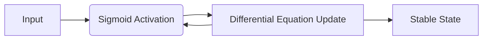

# Continuous Hopfield Networks 🌊

Continuous Hopfield Networks extend the discrete model to use continuous-valued states, making them more biologically realistic and suitable for analog implementation.

## 📅 History
- **First Used:** 1984
- **Original Paper:** [Neurons with graded response have collective computational properties like those of two-state neurons](https://doi.org/10.1073/pnas.81.10.3088)
- **Author:** John J. Hopfield

## 🔍 Detailed Information
Unlike the discrete version, the states in a Continuous Hopfield Network are continuous variables, typically within the range $[0, 1]$. The dynamics are described by a set of coupled differential equations.

### Key Features
- **Graded Response:** Neurons use a sigmoid activation function.
- **Analog Circuits:** Can be mapped directly to hardware using resistors and capacitors.
- **Smooth Energy Landscape:** Allows for more nuanced optimization and memory retrieval.

## 📊 Diagram

[Back to README](../README.md)
