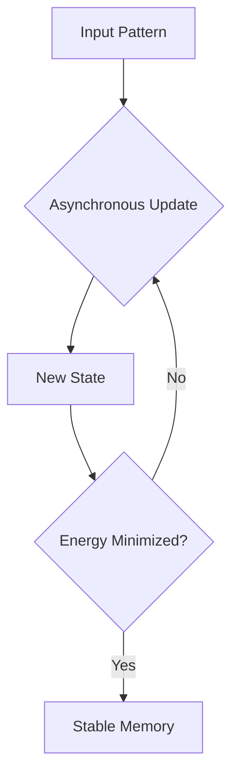

# Discrete Hopfield Networks 🧠

Discrete Hopfield Networks are the foundational model of associative memory introduced by John Hopfield.

## 📅 History
- **First Used:** 1982
- **Original Paper:** [Neural networks and physical systems with emergent collective computational abilities](https://doi.org/10.1073/pnas.79.8.2554)
- **Author:** John J. Hopfield

## 🔍 Detailed Information
A Discrete Hopfield Network consists of $N$ interconnected neurons. Each neuron $i$ has a state $s_i \in \{-1, 1\}$ (bipolar) or $s_i \in \{0, 1\}$ (binary). The network is fully connected, but typically without self-connections ($w_{ii} = 0$).

### Key Features
- **Asynchronous Updates:** One neuron is updated at a time.
- **Energy Function:** The network follows an energy minimization path defined by:
  $$E = -\frac{1}{2} \sum_{i,j} w_{ij} s_i s_j + \sum_i \theta_i s_i$$
- **Convergence:** The network always converges to a local minimum of the energy function.

## 📊 Diagram

[Back to README](../README.md)
