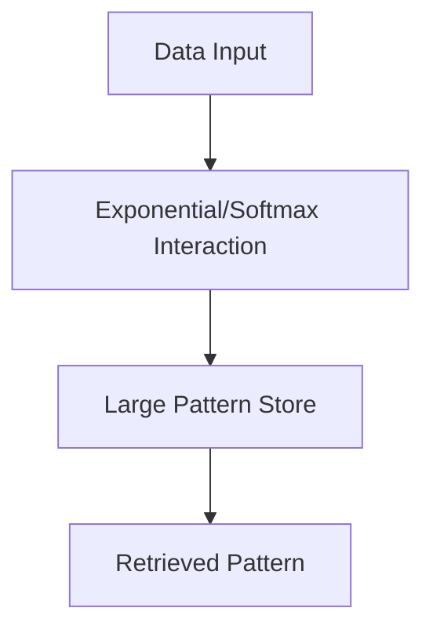

# Modern Hopfield Networks (Dense Associative Memory) 🚀

Modern Hopfield Networks (or Dense Associative Memories) significantly increase the storage capacity of traditional models by introducing stronger non-linearities.

## 📅 History
- **First Used:** 2016
- **Original Paper:** [Dense Associative Memory for Pattern Recognition](https://proceedings.neurips.cc/paper/2016/hash/eaae339c4d89fc102edd9dbdb6a28915-Abstract.html)
- **Author:** Dmitry Krotov and John J. Hopfield

## 🔍 Detailed Information
These networks replace the quadratic energy function with higher-order polynomials or exponential functions. This allows them to store an exponential number of patterns relative to the number of neurons.

### Key Features
- **Exponential Capacity:** Solves the storage limitations of the 1982 model.
- **Attention Mechanism:** Computational equivalence to the self-attention in Transformers.
- **Differentiable:** Can be trained using standard deep learning techniques.

## 📊 Diagram

[Back to README](../README.md)
